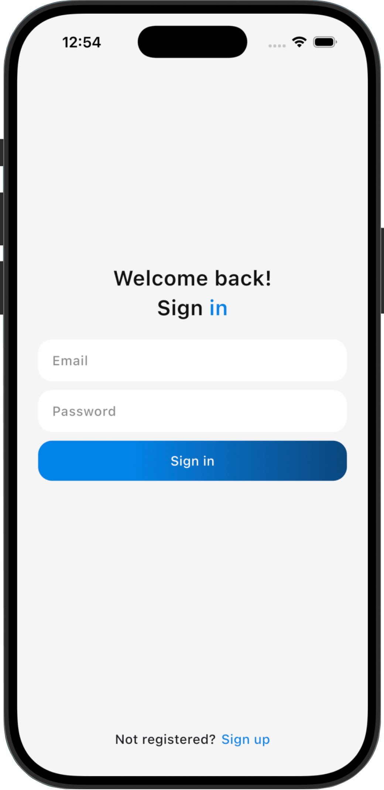
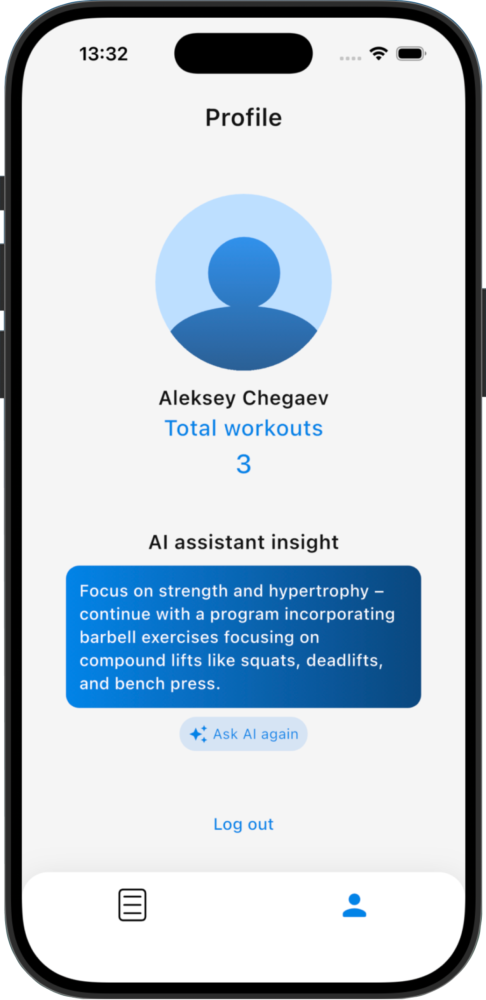
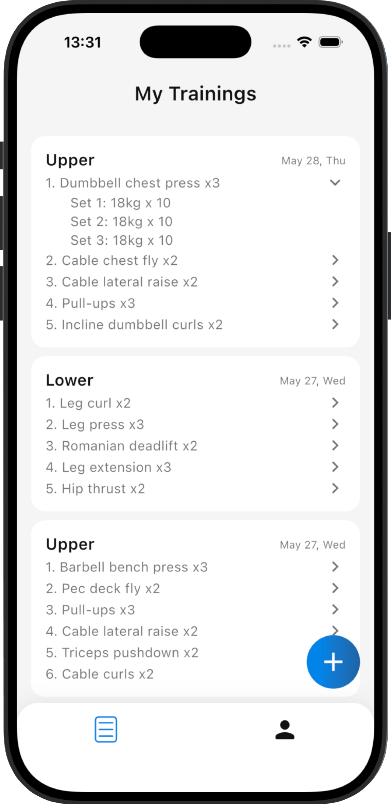
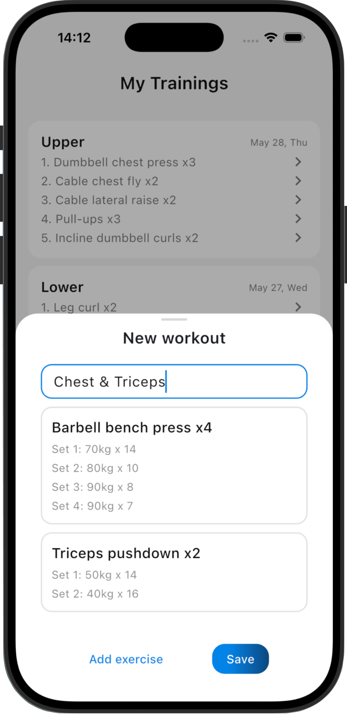
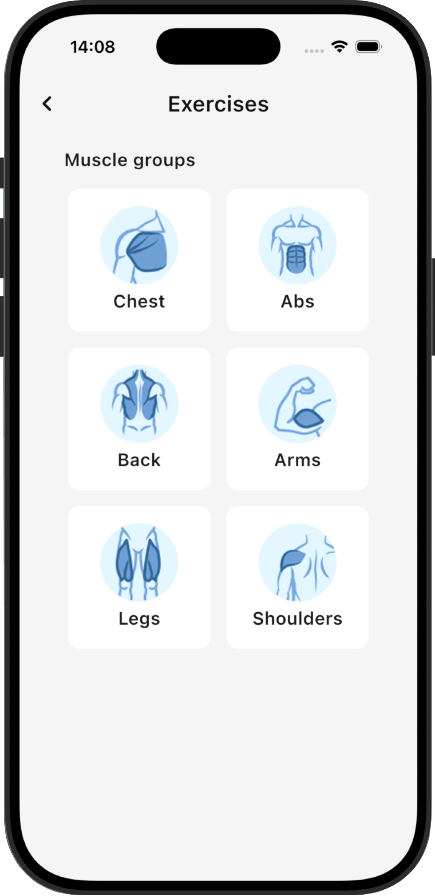
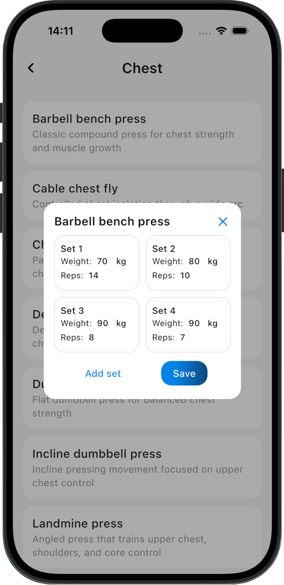

# Fitness Tracker

Flutter app for recording workouts, managing exercise sets, and tracking personal training progress.

## Preview

<p align="center">
  
  &nbsp;&nbsp;
  
  &nbsp;&nbsp;
  
</p>

<br />

<p align="center">
  
  &nbsp;&nbsp;
  
  &nbsp;&nbsp;
  
</p>

## Demo

<p align="center">
  
</p>

## Features

- Email/password authentication with persisted access and refresh tokens.
- Automatic token refresh on unauthorized API responses.
- Training history with expandable workout sessions and swipe-to-delete actions.
- Workout creation flow with exercise selection by muscle group.
- Set tracking for weight and reps.
- Profile screen with user stats and workout insight from AI.
- Loading, empty, and error states for the main data flows.

## Tech Stack

- Flutter / Dart
- Riverpod for dependency injection and state management
- GoRouter for navigation and auth redirects
- Dio for HTTP requests and interceptors
- flutter_secure_storage for token storage
- flutter_slidable for list actions
- GitHub Actions for format, analyze, and test checks

## Project Structure

```text
lib/
  app/                 App shell, routing, theme
  core/
    network/           Dio setup, API errors, auth interceptor, token refresh
    storage/           Secure token storage
    ui/                Shared UI components and states
    utils/             Shared utilities
  features/
    auth/              Login, registration, auth repository
    exercises/         Muscle groups and exercise list
    trainings/         Training history and models
    workout_editor/    Workout creation flow
    profile/           User profile, stats, workout insight
test/                  Unit and widget tests
```

## Configuration

The app expects a REST API. By default it uses:

```text
http://localhost:8080
```

Override it with `API_BASE_URL`:

```bash
flutter run --dart-define=API_BASE_URL=http://localhost:8080
```

For release builds:

```bash
flutter build web --release --dart-define=API_BASE_URL=https://your-api.example.com
```

## API Contract

The current client uses these endpoints:

```text
POST   /auth/login
POST   /auth/logout
POST   /auth/refresh
POST   /users
GET    /users/me
GET    /profile/stats
GET    /suggest-workout
GET    /trainings
POST   /trainings
DELETE /trainings/:id
GET    /muscle-groups
GET    /muscle-groups/:id/workout-types
```

## Getting Started

Install dependencies:

```bash
flutter pub get
```

Run the app:

```bash
flutter run --dart-define=API_BASE_URL=http://localhost:8080
```

Run checks:

```bash
dart format --set-exit-if-changed lib test
flutter analyze
flutter test
```

Build web:

```bash
flutter build web --release --dart-define=API_BASE_URL=https://your-api.example.com
```

## Testing

Current tests cover:

- API exception mapping
- Date formatting
- Token response parsing
- Training model serialization/parsing
- Profile stats parsing
- Primary button widget behavior

## Current Status

The Flutter client is functional and passes format, analyzer, test, and web release build checks. A compatible backend API is required for full app usage.
